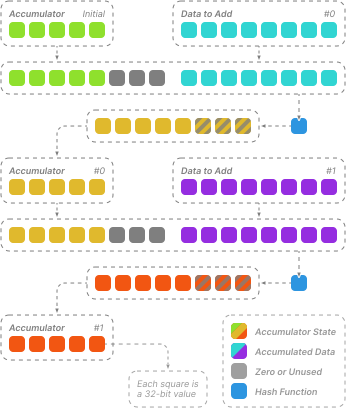
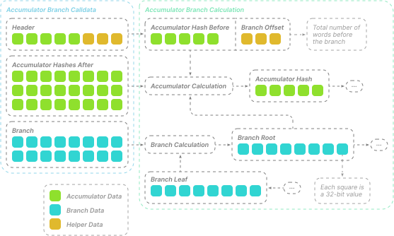

<!-- omit in toc -->
# Flex Contracts 💠

Smart contracts of Flex protocol.

<!-- omit in toc -->
### Table of Contents

- [Overview](#overview)
- [Rationale](#rationale)
- [Order](#order)
  - [Order Tree](#order-tree)
  - [Order Hash](#order-hash)
  - [Order Signature](#order-signature)
- [Component](#component)
  - [Component Facet](#component-facet)
  - [Component Data](#component-data)
  - [Component Domain](#component-domain)
  - [Component Hash](#component-hash)
  - [Component Authorization](#component-authorization)
- [Proof Verifier](#proof-verifier)
- [Flow](#flow)
- [Miscellaneous](#miscellaneous)
  - [Flags](#flags)
  - [Accumulator](#accumulator)
  - [Accumulator Branch](#accumulator-branch)
  - [Standalone](#standalone)
- [Examples](#examples)
  - [EVM Token (Lock) to EVM Native](#evm-token-lock-to-evm-native)
- [Development](#development)
  - [Stack](#stack)
  - [Setup](#setup)
  - [Build](#build)
  - [Test](#test)

## Overview

_"Flex" protocol_ is the superior successor to the "Flash Trade" protocol.

During the operation of the previous version of the protocol, the development team has found several issues that limit
further protocol improvement, and therefore make it difficult to keep enhancing the end user experience. The problems
and solutions to them are described in detail in the [section below](#rationale).

In short, the new Flex protocol allows to conduct order-based deals between parties in a more _flexible_ way, addressing
the issues of the previous version. The flexibility primarily comes from new _dynamic_ [order](#order) structure, that's
made out of Flex [components](#component). The components can be selected, configured, and put together in
[various ways](#flow) according to the current needs of the participating parties. Once an order is created, it's
executed on-chain by an agreed party - for each component there is a designated Flex [facet](#component-facet) designed
to work with it.

## Rationale

The main source of the previous Flash Trade protocol issues was the _monolithic_ order structure. The old structure
consisted of _all_ order fields that are required for the protocol flow. This meant an _entire_ order must be presented
for _every_ operation is in the flow, since order is uniquely identified by the hash of _all_ of its fields. The
implications of this are:

- Modifying order structure in any way (for example, by adding or removing fields) makes _all_ deployed facets that work
  with it invalid, requiring contract re-deploy across multiple chains to fix it.
- Most of the data passed to a facet is _not necessary_ for the functionality itself, but only used to compute the hash.
  This means transaction cost increase for _all_ flow operations if we keep adding new fields in order to implement a
  new functionality and pass them as calldata.
- While it's possible to support multiple order types to address previous issues (for example, order with some extra
  data and one without it), this approach creates its own complications. Now every order type requires its own copy of
  every existing facet, _duplicating_ most of the original code. This makes maintaining and scaling difficult,
  especially across multiple chains.

As can be seen, the monolithic order structure issues make it difficult to implement and support new functionality,
including support for new flows that require their distinct set of fields, or adding support for new chains, that
operate different address types (non-EVM) etc.

The new Flex [order](#order) structure overcomes these issues by grouping functionality into _logical_ components.
Each component is designed to be only aware of data it actually needs. This isolates a component facet from the rest
of unrelated facets, allowing to introduce new components without unnecessary code duplication or re-deployment of
existing facets.

In most cases, an interaction with a component facet only requires the [component data](#component-data) and the
[order branch](#order-tree) to the [order hash](#order-hash), plus some extra dynamic data if intended by the
facet implementation. An example of such dynamic data can be [order signature](#order-signature) from one of the
order parties to authorize an operation, or [proof verifier](#proof-verifier) data for confirming an operation
success.

## Order

Flex order is composed out of multiple [components](#component). The selected set of components specifies
possible [flows](#flow) for the order. The order composure [examples](#examples) can be found in sections below.

The components form the [order tree](#order-tree). The tree can be then hashed, producing the [order hash](#order-hash),
that can be used as a unique identifier of the order. Order hash is also essential for producing the
[order signature](#order-signature).

### Order Tree

Flex order is represented by the [Merle tree](https://en.wikipedia.org/wiki/Merkle_tree) data structure. The "data
blocks" of the tree correspond to the [component data](#component-data), that is then [hashed](#component-hash) to
get the "leaves" of the tree. Leaves can be further [hashed](#order-hash) together to get the "root" hash, that
serves as unique identifier of entire Flex order content.

> [!TIP]
>
> _Order Tree Example_
>
> 

The main property of the Merkle tree data structure is that only _tree branch_ is needed to compute the root hash. This
property is used in Flex component facet implementations, when specific component data and the order branch are passed
in calldata, so the order hash can be computed on-chain with no need to present other components.

> [!TIP]
>
> _Facet C Call Example_
>
> 

Some Flex components may depend on data of other components (or even on data referenced by multiple components).
To avoid passing extra order branches for multiple components, the dependant data can be nested by the component using
a hash value field. Usually this means both the component and dependant data should be passed in calldata along with
single order branch, so the order hash can be computed.

> [!TIP]
>
> _Facet B → D Call Example_
>
> 

Flex SDK provides the following functions for interacting with the order tree structure:

- `flexCalcTree({ leaves })` - builds Flex order tree containing all specified `leaves` (i.e.
  [component hashes](#component-hash))
- `flexCalcBranch({ tree, leaf })` - builds `tree` branch from the `leaf` to the root hash

The SDK implementation puts all leaves on _one_ level which results in the same (±1) branch length for each of them.
It also applies _sorting_ to the leaves in order to be ready for _multi-branches_ (see OpenZeppelin's multi proofs).
Currently the multi-branches are _never_ used in the facet implementations - all cases are covered using dependency
components as shown above. If supporting multi-branches is not a concern - the tree can be constructed even _manually_,
putting leaves on different levels for fine-tuning branch lengths (for example, according to chain cost expectations).

### Order Hash

Flex order hash is a 32-byte value equal to the [order tree](#order) root hash. Flex protocol uses `keccak256` as the
hash function for producing order tree leaves and intermediate tree node hashes. See the section above for the visual
representation.

Each of the tree _nodes_ is represented by 2 _word_ (32-byte each) data. Each word is the `keccak256` hash of a leaf or
hash of a node on the lower level. The node words are _sorted_ in the ascending order, so the `keccak256` hash produced
from the node data is _commutative_. This property means that the hash value remains the same regardless of the order of
the arguments.

Note that while the tree branch hashes are used in commutative hash and thus don't require extra info about their
placement as hash parameter, the branch should be encoded to have the _first_ element to be neighboring hash closest
to the tree _leaf_, and the last element to be neighboring to hash closest to the _root_ hash (but _not_ including the
root).

Order hash can be computed using SDK functions:

- `flexCalcTreeHash({ tree })` - returns the root hash of the `tree`
- `flexCalcBranchHash({ leaf, branch })` - calculates the root hash from `leaf` and its `branch` in the tree

### Order Signature

Order signature by one of the [flow](#flow) parties may be needed for a component as an operation authorization step.
The signing party can be an Externally Owned Account (EOA) or a smart contract. In both cases the signed value is the
[order hash](#order-hash) or derived from it.

The _EOA signature_ is produced by the private key of the owner. The 32-byte order hash value can be signed with the
_Ethereum message_ wrap according to the [EIP-191](https://eips.ethereum.org/EIPS/eip-191) standard or even signed
_directly_ (non-default, requires _flag_ - see info below). The recovered signer must match the expected address from
the [data](#component-data) of verifying component.

> [!TIP]
>
> The EIP-191 signature can be obtained with:
>
> - [MetaMask](https://metamask.io)'s
>   [`personal_sign`](https://docs.metamask.io/wallet/reference/json-rpc-methods/personal_sign)
> - [`viem`](https://viem.sh)'s [`signMessage`](https://viem.sh/docs/actions/wallet/signMessage)
> - [`ethers`](https://ethers.org)'s [`signMessage`](https://docs.ethers.org/v6/api/providers/#Signer-signMessage)

> [!NOTE]
>
> The EIP-191 standard _should not_ be confused with [EIP-712](https://eips.ethereum.org/EIPS/eip-712). Providing the
> typed data signature (for example, by using `eth_signTypedData_v4` instead of `personal_sign`) will result in signer
> recovery failure.
>
> While EIP-712 standard is better than EIP-191 in terms of _observability_ of the structure being signed and _domain_
> verification functionality, it's very limited in _dynamic_ and _tightly packed_ data support the protocol needs.
> These issues are addressed with:
>
> - _Thorough_ off-wallet verification of the Flex order structure component fields by both automated code logic & UI
>   user, ensuring the calculated hash fully matches the hash displayed in wallet UI during signing.
> - _Custom per-component_ [_domain_](#component-domain) mechanism along with contract deployment rules for ensuring
>   signature cannot be re-used in unexpected components.

The _contract signature_ variant allows verification logic to be implemented by a smart contract. The verifying contract
address comes from the [component data](#component-data). For successful flow, the contract must support
[EIP-1271](https://eips.ethereum.org/EIPS/eip-1271) standard, i.e. provide `isValidSignature` function that returns the
signature check result. The `hash` parameter passed to the function is the Flex order hash, the `signature` value is
forwarded as-is from the facet calldata.

The [`FlexSignatureConstraint`](./contracts/libraries/constraints/FlexSignatureConstraint.sol) library provides logic
for validating all of the supported signature types. Besides the order hash and signature bytes, the library accepts
pack of 3 [flags](#flags) that can be passed from the component data (i.e. configured during order formation and cannot
be modified) to control the signature checks:

- Contract signature flag (_#0_) - should the library _skip_ EOA signature check attempt and go straight to the contract
  signature verification. Otherwise attempts to recover EOA signature first, and if it fails - does the contract
  signature verification attempt (if allowed by flag _#2_). This flag is preferred to be set when it's known that
  the contract signature verification flow should be used to save gas costs by skipping the EOA attempt.
- No message signature wrap flag (_#1_) - should the library _skip_ the default wrap of order hash into the EIP-191
  message. The flag should only be enabled when the original order hash was _directly_ signed with private key.
- No retry as contract signature flag (_#2_) - should library _skip_ attempt to verify signature as the contract one
  after EOA recovery failure. Enabling this flag asserts that the signature is expected _only_ as an EOA signature.
  This flag is preferred to set when it's _know_ that EOA signature is provided for ensuring no extra logic run.

> [!TIP]
>
> It's recommended to establish signing party capabilities beforehand and _setup the signature flags accordingly_
>
> 

## Component

Flex component provides a specific functionality. This functionality can be combined with functionalities of other
components in one [order](#order) to achieve a specific [flow](#flow). The component consists of two main parts:

- [_Facet_](#component-facet) - implements component logic
- [_Data_](#component-data) - provides control of the logic

### Component Facet

Component facet is a smart contract that implements logic of a Flex [component](#component). Each `Flex*Facet` has a
_single_ `flex*` function for executing the logic. The _function selector_ should be unique across all Flex components
(i.e. serves as _component type_ identifier). This is easily achieved by following the specified _naming convention_ in
conjunction with the rest of the function signature.

> [!TIP]
>
> Example of following the naming convention for "receive native" component:
>
> - `FlexReceiveNativeFacet` facet provides `flexReceiveNative` function
> - function needs `bytes32`, `bytes32[]` and `bytes` parameters
> - function signature is `flexReceiveNative(bytes32,bytes32[],bytes)`
> - signature corresponds to the `0xb14c7338` function selector

The facet contract is deployed on-chain and assigned unique (across chain, function selector, and implementation
version) [domain](#component-domain) to distinguish [component data](#component-data) intended to be used with the
particular facet deployment. The data is passed to facet contract during call and handled by the logic according to the
implementation.

Flex facets are designed in such a way that all accepted _deploy_ parameters are saved as _immutables_ with no extra
initialization methods (those are common in more traditional _re-useable_ facet approach - see the note on the facet
re-usability below). Parties don't interact with each individual facet, instead facets are bundled into a single _main_
_Flex contract_. There are two primary ways this can be achieved:

- Facets deployed as individual contracts and then added to main [diamond](https://eips.ethereum.org/EIPS/eip-2535)
- Facets deployed as part of [standalone](#standalone) version of main contract

> [!WARNING]
>
> Deployed facets _must never_ be re-used in more than one _active_ (i.e. _publicly_ available for parties to provide
> _real asset_ allowance to) diamonds. This creates domain re-use situation which may pose _security risks_, for
> example - double signature usage for extra asset collection from the signed party. If a _new diamond_ should become
> public - a _new set of facets_ must be deployed for it.
>
> Parties should never approve a new diamond contract that has _any_ facet domain re-use. Multiple _standalone_ versions
> are much safer to approve in domain re-use regard, since each new standalone contract is made out of a new set of
> facets with new domains. While unlikely for small deploy counts, domain collisions are still possible even here - so
> it's better to always verify domain uniqueness across _all_ approved Flex contracts.

### Component Data

Component data allows to control specific actions of the [facet](#component-facet) implementation during calls in
accordance with the requirements of the [flow](#flow) parties. Usually the component data passes some form of
[authorization](#component-authorization) first before sensitive operations are performed.

The data is represented by an array of 32-byte words. The exact number of the elements is up to component
implementation. Component data must at least fit the [domain](#component-domain), which is mixed-in on-chain by facet
prior the [hash calculation](#component-hash), which serves as [order tree](#order-tree) leaf.

Flex SDK provides a set of functions for encoding data for all currently supported components. These functions have
recognizable `flexEncode*Data` names. For example:

- `flexEncodeReceiveNativeData({ ... })`
- `flexEncodeReceiveTokenData({ ... })`
- `flexEncodeSendNativeFloatData({ ... })`
- etc

> [!TIP]
>
> Component data encoded with `flexEncode*Data` function is _[domain](#component-domain)-agnostic_, meaning it has
> _zero_ value where domain is supposed to be. Such data _can_ be used for facet call (since domains are mixed-in
> on-chain by [facets](#component-facet)). However, it won't produce correct [component hash](#component-hash) on its
> own - the corresponding `flexCalc*Hash` function should be used to target the data to a specific domain.

Individual components should be encoded with an entire [flow](#flow) in mind. See more [examples](#examples) of data
encoding below.

### Component Domain

Flex component domain is an 8-byte value that allows to validate [component data](#component-data) target validity,
i.e. that the data is used with parties-intended [facet contract](#component-facet). This is achieved by mixing-in
domain value into the component data prior the [component hash](#component-hash) calculation.

In current Flex contract, the domain value is calculated on-chain during the facet deployment and stored as _immutable_
value (i.e. never changes after the assignment). The calculation implementation can be found in
[FlexDomain](./contracts/libraries/utilities/FlexDomain.sol) library. In short, the first 8 bytes of `keccak256` hash
function output are taken, which is a result of applying the hash to the data made out of concatenation of the following
attributes:

- `chainid` - ID of the current chain to ensure _uniqueness across chains_
- `selector` - selector of the component function to ensure _uniqueness across components_
- `target` - address of the facet contract to ensure _uniqueness across implementations_

> [!NOTE]
>
> The described hash-based domain calculation algorithm is used by current EVM implementation of Flex protocol. Other
> chains may operate on different data types for similar attributes. So it's _not a required_ way to implement the
> domain assignment.
>
> The hash approach to implementation is _recommended_ to make collisions highly unlikely. But overall, the algorithm
> can be as simple as passing domain value via the constructor. But in this case, collision management is a _much_
> bigger concern.
>
> The main expectations for domain assignment implementation are:
>
> - Uniquely identifies component across all the attributes
> - Initialized before exploitation phase
> - Cannot be modified during exploitation
> - Can be read from contract using view function
>
> Following these rules allow to safely _cache_ domain values as part of the deploy info. With the ability to store the
> values, there is no need to read domains or compute them offline every time, and the specifics of the domain
> assignment algorithm become not important.

For each component's `Flex*Facet` contract, Flex provides `Flex*DomainFacet` contract with `flex*Domain` function for
reading the assigned domain value. For example, `FlexReceiveNativeDomainFacet.flexReceiveNativeDomain()` corresponds
to the `FlexReceiveNativeFacet.flexReceiveNative(...)` component.

### Component Hash

Component hash is calculated using `keccak256` function. The data for the hash is made out of concatenation of all
32-byte words of the [component data](#component-data). Component hash serves as leaf in the [order tree](#order-tree).

Generic component hash can be calculated using `flexCalcComponentHash({ domain, data })` SDK function. The `data` is
the array of encoded component data words. Note that [component data](#component-data) encoded with `flexEncode*Data`
functions of SDK does not contain the [domain](#component-domain) on its own, so the `domain` parameter should be
provided.

> [!TIP]
>
> It's preferred to calculate hash using _component-specific_ function named `flexCalc*Hash`. For example:
>
> - `flexCalcReceiveNativeHash({ domain, data })`
> - `flexCalcReceiveTokenHash({ domain, data })`
> - `flexCalcConfirmNativeHash({ domain, data })`
> - etc

### Component Authorization

Component logic often requires operation authorization from one of the [flow](#flow) parties. The most common
authorization patterns to be aware of are:

- [Order signature](#order-signature) verification based on [order hash](#order-hash) calculated from the
  [component hash](#component-hash)
- Time constraints (i.e. deadline or earliness)
- Providing unlock key held by other party so it matches key hash in the order
- Providing proof for the [proof verifier](#proof-verifier)
- Providing record with its [hash accumulator](#accumulator) history
- Incentivize to produce correct [order hash](#order-hash) as result (as event argument or storage record):
  - Enables successful event verification for the party that's interested in it due to some risk
  - Can be verified by other party to reveal the unlock key or by [proofer](#proof-verifier)
  - Any alteration of expected order flow produces _wrong_ order hash:
    - Modifying any order field in calldata
    - Calling facet with unexpected domain
    - Using not agreed account as a contract caller
    - Providing different message value
    - etc

> [!TIP]
>
> As shown in the [order tree](#order-tree) visualizations, the [order hash](#order-hash) is calculated on-chain using
> the [hash](#component-hash) of [component data](#component-data) (bound to specific [domain](#component-domain)) and
> the order branch.

## Proof Verifier

...

## Flow

...

## Miscellaneous

### Flags

Flex flags are booleans encoded using single bit per value. Flags can be _packed_ - i.e. grouped together for easier
access. Flag with index 0 occupies _least significant bit_, index 1 - next bit by significance after the previous value,
and so on.

Usually flag packing is done by higher-level SDK functions. However, it can be done manually using `flexPackFlags`.
For example:

```ts
import { flexPackFlags } from '@swaps-io/flex-sdk';

const value = flexPackFlags([
  true,      // Flag #0
  false,     // Flag #1
  true,      // Flag #2
  undefined, // Flag #3 (false)
  null,      // Flag #4 (false)
  true,      // Flag #5
], 7);       // Shift to higher bits (optional)

console.log(value); // Logs `5248n`: `0b1010010000000n`
```

### Accumulator

Flex accumulator is a data structure that allows to store sequence of _multiple_ 32-byte values in a _single_ 20-byte
value. The stored values cannot be accessed _directly_, but their _presence_ at some point can be _proven_ using value
history fragment from that moment and to the current value of the accumulator.

> [!NOTE]
>
> The 20-byte size for accumulator is selected to have sufficient hash security (same size as EVM addresses use), while
> leaving 12-byte space in a 32-byte word for arbitrary metadata storage (which _doesn't_ participate in accumulator
> state calculation).

Accumulator starts with the initial value - usually zero `0x00..00` (SDK's `FLEX_UNALLOCATED_HASH`), but can also be
`0x11..11` (SDK's `FLEX_ALLOCATED_HASH`) if storage _pre-allocation_ was carried out. Then for each 32-byte value added,
new accumulator state is calculated as `keccak256` hash of data made out of the current accumulator value + value to add
(the implementation can be found in [`FlexHashAccumulator`](./contracts/libraries/utilities/FlexHashAccumulator.sol)).

> [!TIP]
>
> _Accumulator Calculation Example_
>
> 

To prove the presence of a 32-byte value in the accumulator, the accumulator state _before_ the value should be
provided, as well as the history array of 32-byte values recorded _after_ the target value until current known
accumulator state. These values are usually passed as part of the [accumulator branch](#accumulator-branch).

> [!NOTE]
>
> Accumulator calculation is _similar_ to [order hash](#order-hash) calculation from the [tree branch](#order-tree).
> However, there are differences: the _shorter_ hash value of previous accumulator state and the fact that it's always
> at the specific location in the data being hashed, i.e. the hash is _non-commutative_.

Flex SDK provides `flexCalcAccumulatorHash({ hashBefore, hashToAdd })` function for generic calculation of updated
accumulator state. There are more component-specific accumulator functions as well:

- `flexCalcReceiveAccumulatorHash({ hashBefore, orderHash })` - for receive components
- `flexCalcSendAccumulatorHash({ hashBefore, orderHash, start })` - for send components

### Accumulator Branch

In Flex protocol, it's very common to have to compute [order hash](#order-hash) from the [branch](#order-tree) first,
and then check if the resulting hash is contained in current [accumulator](#accumulator) state (known from contract
storage). For this reason, the protocol has special "accumulator branch" data type that includes both of the parts. The
implementation can be found in [`FlexHashTree`](./contracts/libraries/utilities/FlexHashTree.sol) utility library.

The fist 32-byte word of the accumulator branch is _header_, containing 20-byte accumulator hash before and 12-byte
_branch_ offset expressed in _number of the words_ before the first branch word (i.e. the header word _does contribute_
to the offset). Between header and the branch there are _accumulator hashes after_. The _branch root_ calculated from
the _branch leaf_ (i.e. component hash) is expected to be sandwiched between the before and after accumulator hashes.

> [!TIP]
>
> _Accumulator Branch Example_
>
> 

The accumulator branch can be composed using SDK's `flexCalcAccumulatorBranch({ branch, hashBefore, hashesAfter })`.
The `branch` value is obtainable using `flexCalcBranch({ tree, leaf })`.

### Standalone

The standalone version is a contract that includes all of the current Flex [facets](#component-facet). The
[`FlexStandalone`](./contracts/standalone/FlexStandalone.sol) contract can be deployed on its own without the
[diamond](https://eips.ethereum.org/EIPS/eip-2535) for hosting the facets.

> [!NOTE]
>
> Calls to the standalone version are more gas-efficient since they don't require storage reads of the implementation
> addresses like in the diamond proxy.
>
> This comes with a feature that it is not possible to modify the set of facets without redeploying the contract,
> i.e. standalone deploy is immutable.

## Examples

### EVM Token (Lock) to EVM Native

In this example, account `0x1010..1010` gives `123` of token `0xe0e0..e0e0` (`6` decimals) to account `0x2020..2020`
in the receive chain. In return that accounts gives `2.5` of native crypto (`18` decimals) back in the send chain.

Received token is stored in contract waiting for settlement - either confirm (requires key kept by `0x1010..1010`)
or refund (requires key kept by `0x2020..2020`). As a fallback to the key settlement (imagine one of the parties going
offline), similar proof settlement components are added to the order (TODO).

```ts
import {
  flexEncodeReceiveTokenData,
  flexEncodeSendNativeData,
  flexEncodeConfirmTokenData,
  flexEncodeRefundTokenData,
  flexCalcReceiveTokenHash,
  flexCalcSendNativeHash,
  flexCalcConfirmTokenHash,
  flexCalcRefundTokenHash,
  flexCalcTree,
  flexCalcTreeHash,
  flexCalcBranch,
} from '@swaps-io/flex-sdk';

// Flex contract instances on target chains
const flexOnReceiveChain: FlexStandalone = ...;
const flexOnSendChain: FlexStandalone = ...;

// Time in seconds
const now = BigInt(new Date().getTime()) / 1000n;
const timeToReceive = 2n * 60n;
const timeToSend = 10n * 60n;

// Encode receive token component
const receiveTokenData = flexEncodeReceiveTokenData({
  sender: '0x1010101010101010101010101010101010101010',
  receiver: '0x2020202020202020202020202020202020202020',
  receiverContract: true,
  token: '0xe0e0e0e0e0e0e0ee0e0e0e0e0e0e0ee0e0e0e0e0',
  amount: 123_000000n,
  deadline: now + timeToReceive,
  nonce: 123n,
});
const receiveTokenDomain = await flexOnReceiveChain.read.flexReceiveTokenDomain();
const receiveTokenHash = flexCalcReceiveTokenHash({
  domain: receiveTokenDomain,
  data: receiveTokenData,
});

// Encode send native component
const sendNativeData = flexEncodeSendNativeData({
  sender: '0x2020202020202020202020202020202020202020',
  receiver: '0x1010101010101010101010101010101010101010',
  amount: 2_500000000_000000000n,
  start: now,
  duration: timeToSend,
  group: 0n,
});
const sendNativeDomain = await flexOnSendChain.read.flexSendNativeTokenDomain();
const sendNativeHash = flexCalcSendNativeHash({
  domain: sendNativeDomain,
  data: sendNativeData,
});

// Encode key settle with confirm component
const confirmTokenData = flexEncodeConfirmTokenData({
  // Same as receive token params
  receiver: '0x2020202020202020202020202020202020202020',
  receiverContract: true,
  token: '0xe0e0e0e0e0e0e0ee0e0e0e0e0e0e0ee0e0e0e0e0',
  amount: 123_000000n,
  deadline: now + timeToReceive,
  nonce: 123n,

  // Original random confirm key is kept by 0x1010..1010
  keyHash: '0x9e5077555fd13cabbb8c0b93e6dbdc52bc018c208595cdba5808a886b93935b4',
  confirmReceiver: '0x2020202020202020202020202020202020202020',
});
const settleTokenDomain = await flexOnReceiveChain.read.flexSettleTokenDomain();
const confirmTokenHash = flexCalcConfirmTokenHash({
  domain: settleTokenDomain,
  data: confirmTokenData,
});

// Encode key settle with refund component
const refundTokenData = flexEncodeRefundTokenData({
  // Same as receive token params
  receiver: '0x2020202020202020202020202020202020202020',
  receiverContract: true,
  token: '0xe0e0e0e0e0e0e0ee0e0e0e0e0e0e0ee0e0e0e0e0',
  amount: 123_000000n,
  deadline: now + timeToReceive,
  nonce: 123n,

  // Original random refund key is kept by 0x2020..2020
  keyHash: '0x474bbf551e597e41f8f7de7844d97405f67f4e89608019511b71730a1470353e',
  refundReceiver: '0x1010101010101010101010101010101010101010',
});
const refundTokenHash = flexCalcRefundTokenHash({
  domain: settleTokenDomain,
  data: refundTokenData,
});

// Build order tree & calc hash
const componentHashes = [receiveTokenHash, sendNativeHash, confirmTokenHash, refundTokenHash];
const orderTree = flexCalcTree({ leaves: componentHashes });
const orderHash = flexCalcTreeHash({ tree: orderTree });

// Order branches to use during facet interaction
const receiveTokenBranch = flexCalcBranch({ tree: orderTree, leaf: receiveTokenHash });
const sendNativeBranch = flexCalcBranch({ tree: orderTree, leaf: sendNativeHash });
const confirmTokenBranch = flexCalcBranch({ tree: orderTree, leaf: confirmTokenHash });
const refundTokenBranch = flexCalcBranch({ tree: orderTree, leaf: refundTokenHash });
```

## Development

### Stack

- __Language__: Solidity v0.8.26+
- __Framework__: Hardhat
- __Node.js__: v22.2
- __Yarn__: v4.5

### Setup

`yarn`

### Build

`yarn build` (or `yarn b`)

### Test

`yarn test` (or `yarn t`)
